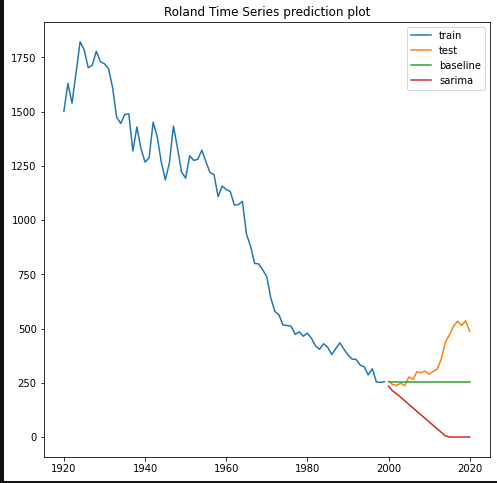
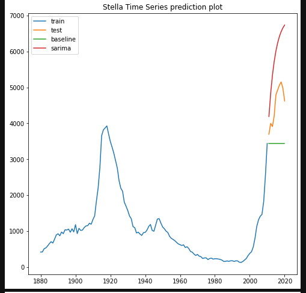
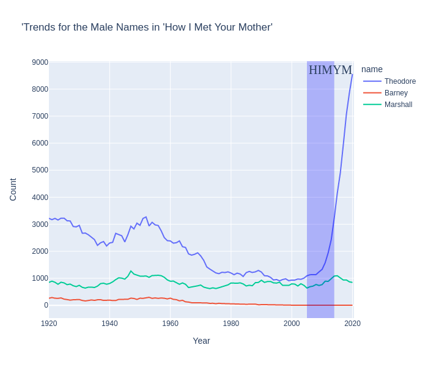
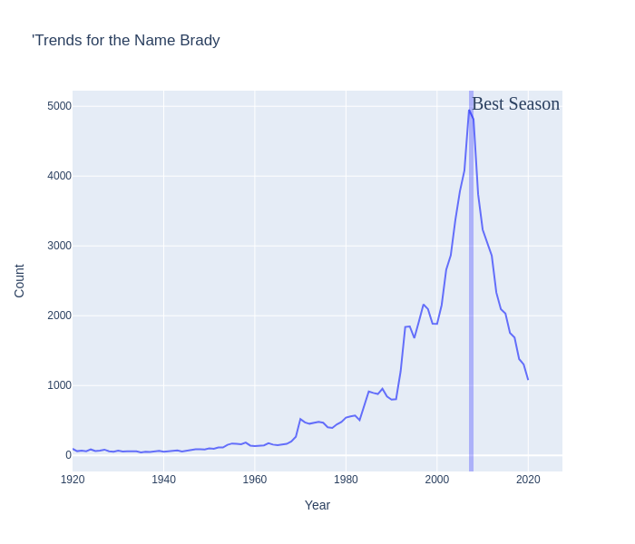
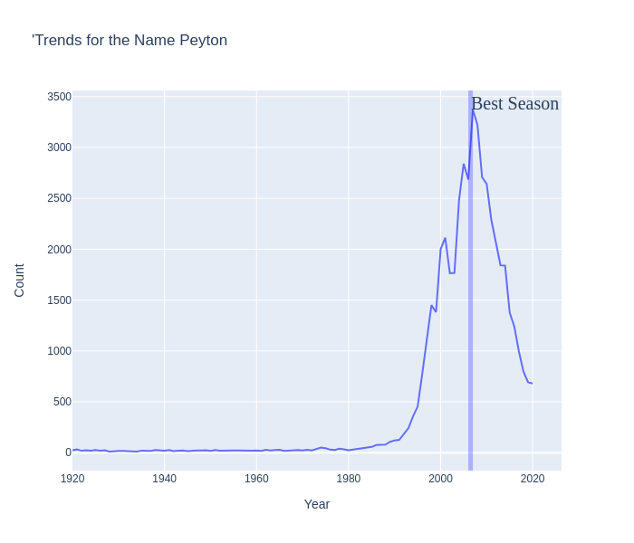

## SARIMA Time Series: Modeling to Predict Baby Name Popularity

#### EXECUTIVE SUMMARY
The baby name popularity predictor project was borne of the anxiety of soon-to-be-parents in making the first decision of countless in the lives of their children.  The project sought to use time series modeling to predict the future popularity of a specific name, based on data acquired from the US Social Security Administration.  The dataset was procured from dataworld.com and is linked below in the data sources section.  The data includes information for registered names from 1880 to 2020 of at least five counts per year.  The goal of the project was to produce a time series model that would accurately predict the trend line of popularity (in count of name) for popular names through 2036.  The final model selected was a SARIMA model that had a lower mean absolute error than the baseline projection of last known count in roughly 50 percent of the sample set.  The model accurately predicted changes in trend patterns using a test size of 30 percent (depending on when the name first showed in the dataset) for the most popular names--defined as male names that had more than 993 mentions in one year for at least 10 years and female names that had at least 825 mentions in one year for at least 10 years from 1920 to 2020. The model accurately predicted trends in 50.2 percent of female name and 57.6 percent of male names.

A scrub of the data revealed that the model struggled to accurately predict dramatic changes in trends in the test sample--for example, the name "Theodore" saw a dramatic upward trend circa 2020, reversing decades of continuous slow trend downward.  The SARIMA model was unable to capture the change as it never saw any indication that the pattern would shift.  This illuminates the significant hazard of trying to use models to predict the popularity of baby names with no other exogenous information.  The popularity of baby names is notoriously fickle--just as one name dramatically rises in popularity, in just a few years--the name reaches its zenith and usually begins a downward trajectory.  No clear singular reason is apparent for a name's popularity--beloved television characters may catapult a formerly unpopular name, or likewise a hit song or sports hero may inspire imitation in soon to be parents.  In a majority of cases, however, the dramatic shift upward in a name's popularity then shows a sometimes equally dramatic shift downward in just a few years--indicating that names usually reach a maximum threshold of popularity where they are deemed "too common" by soon to be parents and are rejected.  

Recommendations for further analysis would be grab a larger set of names to examine and model.  This project was limited in the size and scope of the number of names it could model because of data storage limitations.  However, a larger project could incorporate more names and include data that provides deeper insight into changes in demographic, cultural, and ethnic/racial naming trends.  Additionally, the next steps in the project would be to include other exogenous trends or events--either pop culture, sports, or news--to see if the model can pick up impending shifts in the popularity of names. 

#### TABLE OF CONTENTS
[Data Sources](#data-sources) 
[Data Dictionary](#data-dictionary) 
[Conclusions and Recommendations](#conclusions-and-recommendations) 
[Other Sources](#sources) 

#### 1. DATA SOURCES

This project used the following dataset: 
<a href = "https://data.world/nkrishnaswami/us-ssa-baby-names-national"> [Original SSA (National) Names Dataset]</a> 

The jupyter notebook used to clean the data can be accessed via the link below 
<a href = "https://git.generalassemb.ly/nasimmosley/brandnewsubmissions/blob/master/Projects/Final%20Capstone%20Baby%20Names/2.%20Cleaning.ipynb">     [Cleaning Code]</a> 

The jupyter notebook used to preprocess the data and conduct EDA can be accessed via the link below 
<a href = "https://git.generalassemb.ly/nasimmosley/brandnewsubmissions/blob/master/Projects/Final%20Capstone%20Baby%20Names/3.%20EDA.ipynb">[EDA and Preprocessing]</a> 

The notebooks used to conduct modeling and forecasting can be accessed via the link below 
<a href= "https://git.generalassemb.ly/nasimmosley/brandnewsubmissions/tree/master/Projects/Final%20Capstone%20Baby%20Names/4.%20Models">[Modeling and Forecasting]</a> 

The final pickled datasets with forecasted predictions can be accessed via the link below 
<a href = "https://git.generalassemb.ly/nasimmosley/brandnewsubmissions/tree/master/Projects/Final%20Capstone%20Baby%20Names/5.%20Final%20Data">[Final_data_pickled]</a> 

The streamlit file used for the baby prediction app can be accessed via the link below 
[Streamlit Baby App](finalbabyapp.py)

**************************************************************************************************************
#### DATA DICTIONARY

*The final dataset uses the following data dictionary:*

| Feature 	| Type   	| Dataset 	| Description                                                                                                      	|
|---------	|--------	|---------	|------------------------------------------------------------------------------------------------------------------	|
| Year    	| index  	|         	| The year in which the name was registered                                                                        	|
| Name    	| object 	|         	| The name of the child registered with the US Social Security Administration                                      	|
| Sex     	| object 	|         	| The sex of the child identified with that specific name as registered with the US Social Security Administration 	|
| Count   	| float  	|         	| The number of babies with that name for that year as registered with the US Social Security Administration       	|

#### CONCLUSIONS AND RECOMMENDATIONS
The SARIMA model performed relatively well against the baseline of last known count for predictions for most popular names.  In the model, SARIMA had a lower mean squared error than the baseline prediction in roughly 57.6 percent of male names and 50.2 percent of female names, using a 30 percent test size and the full data set from 1880-2020.  SARIMA appeared to significantly underperform--a difference in the mean absolute error with the baseline of more than 50 percent--when the name showed dramatic shifts in popularity after the train data--so it had no data to predict a potential dramatic shift or alternatively, it predicted a continuing sharp downward trend when the name's downward trend started to level off.  Names, particularly, are predisposed to having these dramatic shifts--something in the culture can dramatically increase the popularity of a name until "too many" of that name appear and thereafter a dramatic shift in the other direction can result.  

The image below shows where the SARIMA model performed worse than baseline because of a significant shift in the popularity of a name in the test sample:

The image below shows where the SARIMA model performed worse than baseline because of a leveling off of the popularity of a name in the test sample:

No clear explanations are available for why a name may dramatically increase in popularity--it is usually different for each name--and notoriously difficult to predict, according to <a href ="https://daily.jstor.org/science-baby-names">studies on baby naming popularity</a>. Some may have to do with popular TV shows as perhaps evidenced by the huge uptick for the name "Theodore", the sympathetic lead character of the popular sitcom "How I Met Your Mother" or likewise the peak of the name "Brady" during NFL Quarterback Tom Brady's best season, or his rival Peyton Manning.

Recommendations for further analysis would be to include a larger set of names to examine and model.  This project was limited in the size and scope of the number of names it could model because of data storage and processing limitations.  However, a larger project could incorporate more names and include data that provides deeper insight into changes in demographic, cultural, and ethnic/racial naming trends.  Additionally, the next steps in the project would be to include other exogenous trends or events--either pop culture, sports, or news--to see if the model can pick up impending shifts in the popularity of the names. 

#### SOURCES:
https://en.wikipedia.org/wiki/How_I_Met_Your_Mother 
https://www.sportskeeda.com/nfl/ranking-10-best-seasons-tom-brady-s-career 
https://athlonsports.com/nfl/peyton-mannings-top-10-nfl-seasons 
https://www.mentalfloss.com/article/74541/14-memorable-facts-about-family-ties 
https://www.imdb.com/title/tt0083413/ 
https://www.bbc.co.uk/newsround/36703417 
https://daily.jstor.org/science-baby-names 
https://www.livescience.com/6569-good-bad-baby-names-long-lasting-effects.html 
https://data.world/nkrishnaswami/us-ssa-baby-names-national 
https://www.billiejeanking.com/biography/ 
https://en.wikipedia.org/wiki/Demi_Moore 
https://www.businessinsider.com/what-you-name-your-kids-will-affect-their-success-2016-9#women-at-the-top-are-more-likely-to-use-their-full-names-13 
https://www.babycenter.com/0_i-regret-the-name-i-gave-my-child_10346611.bc

